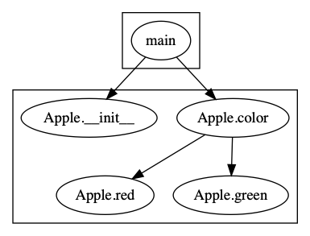

# 实验报告

## 功能描述

将Python代码的过程间调用图展现出来

## 需求分析

输入为Python抽象语法树或者Python源代码
输出为过程间调用关系图

[PyCallGraph](https://github.com/gak/pycallgraph) 通过记录程序运行trace来构建调用关系。然而现实中许多Python项目因为缺少外部依赖或者存在运行时错误等原因无法运行程序，这将限制PyCallGraph的使用。

本实验使用静态分析的方法构建

## 概要设计

1）静态分析：抽象解释

2）动态分析：求解器求解程序输入 

## 详细设计

分为四个步骤

1. 生成抽象语法树
2. 简化AST，去除控制流信息，如for循环、while循环、if语句等。
3. 解析AST获取全局定义，类似Python的import语句。
4. 解析AST获取过程间调用关系

实现代码请见[InterPy](https://github.com/bryce-ma/interpy)

## 实验1

输入程序为以下源代码

```python
class Apple:
    def __init__(self, name):
        self.name = name
    def color(self):
        lname = self.name.lower()
        if lname == 'gala' or lname == 'fuji':
            self.red(self.name)
            return 'red'
        else:
            self.green(self.name)
            return 'green'

    def red(self, rname):
        print('Are u want to eat red apples? so '+ rname + ' is red. Plz')
    def green(self, gname):
         print('Are u want to eat green apples? so '+ gname + ' is red. Plz')

def main():
    apple = Apple('fuji')
    color = apple.color()
    print('The color of this apple is: '+ color)

if __name__ == '__main__':
    main()
```

输出为关系图



### 与pycallgraph对比


可见静态分析（interpy）在一般情况下的代码覆盖率比动态分析（pycallgraph）高。

## 实验2

分析本项目内的源代码文件 `./interpy/visitor1.py` 


## 实验3

分析requests项目下源代码文件的 `models.py'


## 总结

### 难点

Python的ast库生成的抽象语法树节点类型较多，一棵树往往深度较大，抽象解释过程中，上下文的确定需要记录执行状态，当程序结构变得复杂时，上下文确定越困难。