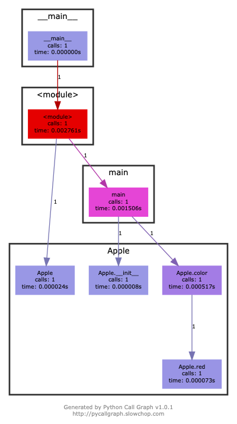
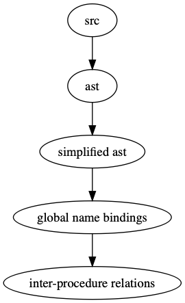

# Python过程间调用分析

##### 马洪跃

##### 2018-12-29

##### Github项目地址 [InterPy](https://github.com/bryce-ma/interpy)

---

# PyCallGraph

### [项目地址](https://github.com/gak/pycallgraph/#python-call-graph)

---

```python
class Apple:
    def __init__(self, name):
        self.name = name
    def color(self):
        lname = self.name.lower()
        if lname == 'gala' or lname == 'fuji':
            self.red(self.name)
            return 'red'
        else:
            self.green(self.name)
            return 'green'
    def red(self, rname):
        print('R u want to eat red apples? '+ rname + ' is red. Plz')
    def green(self, gname):
        print('R u want to eat green apples? '+ gname + ' is red. Plz')

def main():
    apple = Apple('fuji')
    color = apple.color()
    print('The color of this apple is: '+ color)
```

---

<!-- paginate: true -->

# 

---

# 

---

# PyCallGraph

- 需要运行待分析源代码
- 代码覆盖不全
- 考虑通过求解器生成输入数据

---

# InterPy

- 静态分析 无须运行源代码
- 代码覆盖100%
- 现版本支持单个Python源文件

---

## Four Passes 

# 

---

# First pass

- trivial
- python api: ast.parse()

---

# Second pass

- 简化抽象语法树
- 去除控制流信息
- for loop, while loop, if, etc.
- ast.NodeTransformer

---

# Third pass

- 从AST中解析过程信息
- 类似于Python的import过程

---

# Fourth pass

- 获取过程间调用信息
- 类似于Python的解释执行过程

---
# Demo time
---
# TODOs

- 多文件解析
- 处理Python动态性
___


# Q&A


