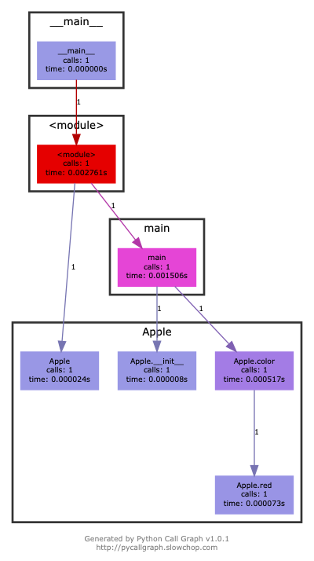
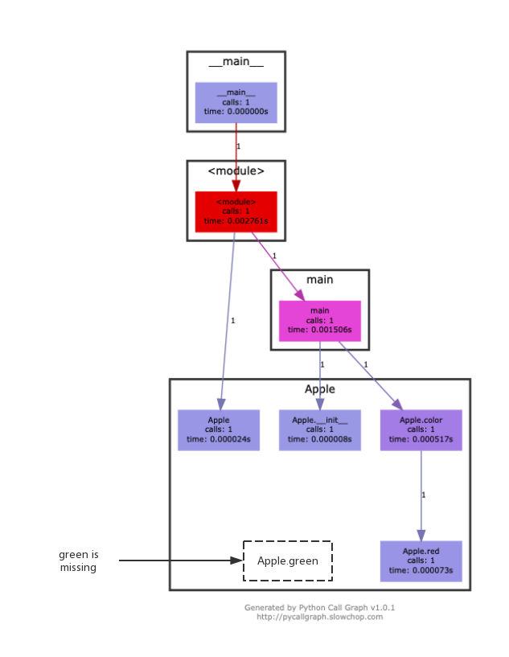

# Python过程间调用分析

##### 马洪跃

##### 2018-12-29

##### Github项目地址 [interpy](https://github.com/bryce-ma/interpy)


---

# PyCallGraph

---

```python
class Apple:
    def __init__(self, name):
        self.name = name
    def color(self):
        lname = self.name.lower()
        if lname == 'gala' or lname == 'fuji':
            self.red(self.name)
            return 'red'
        else:
            self.green(self.name)
            return 'green'
    def red(self, rname):
        print('R u want to eat red apples? '+ rname + ' is red. Plz')
    def green(self, gname):
        print('R u want to eat green apples? '+ gname + ' is red. Plz')

def main():
    apple = Apple('fuji')
    color = apple.color()
    print('The color of this apple is: '+ color)
```

---

<!-- paginate: true -->

# 

---

# 

---

# PyCallGraph

- 需要运行待分析源代码
- 代码覆盖不全
- 考虑通过求解器生成输入数据

---

# InterPy

- 静态分析 无须运行源代码
- 代码覆盖100%

---


---

# Q&A


